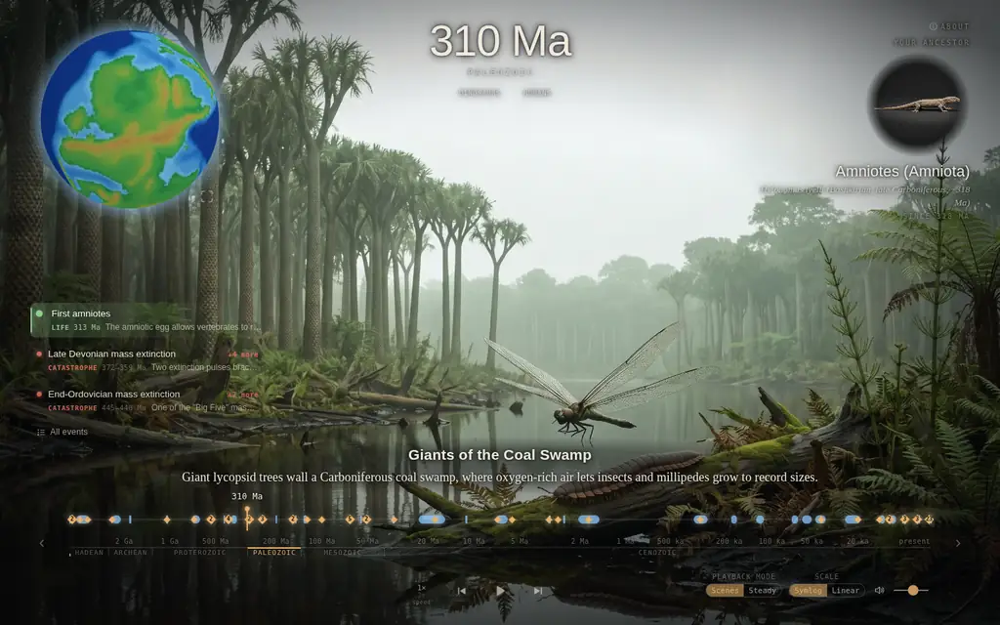
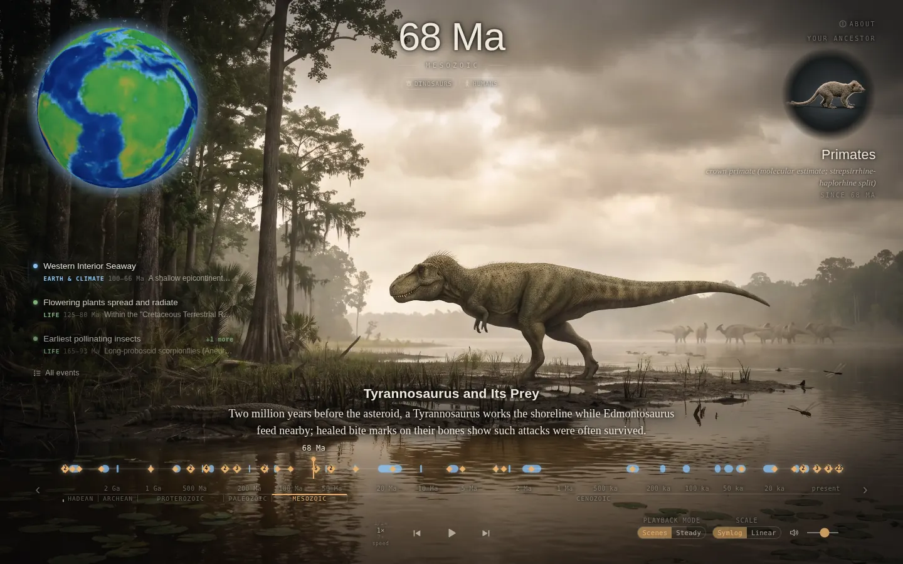
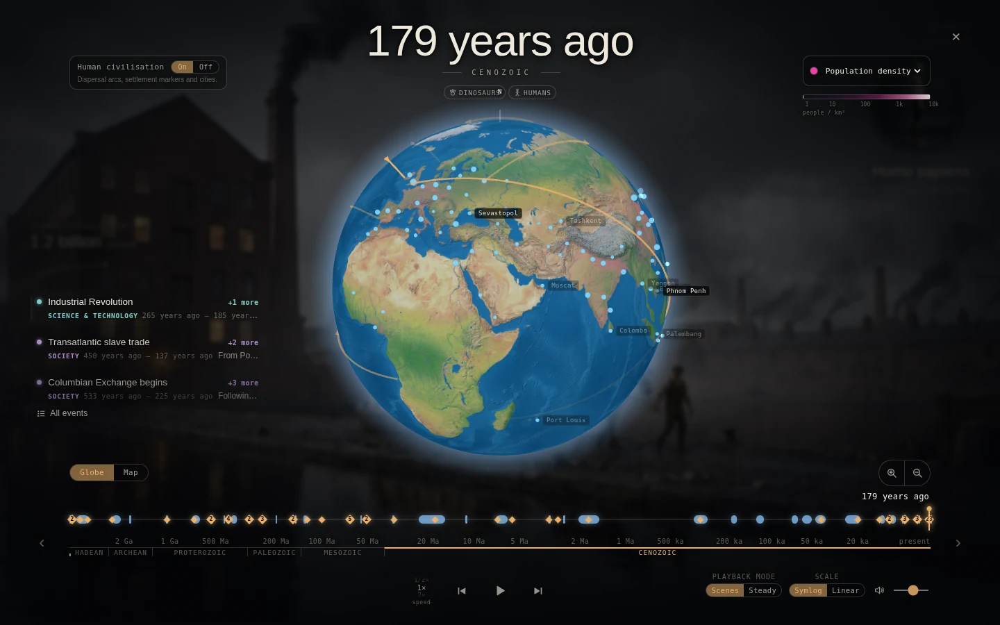
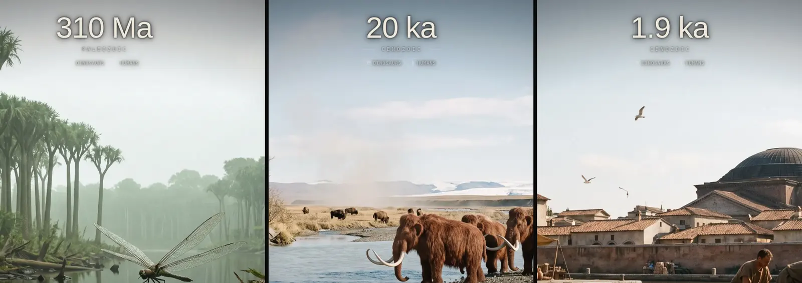
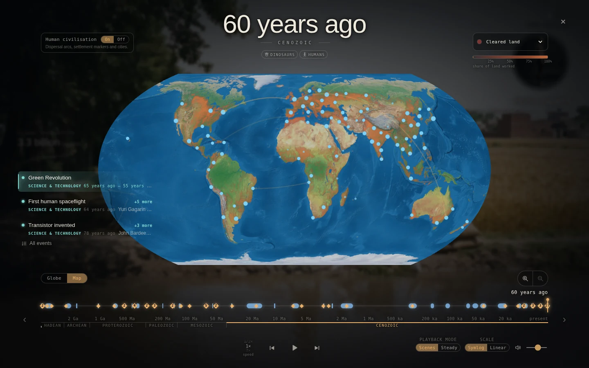
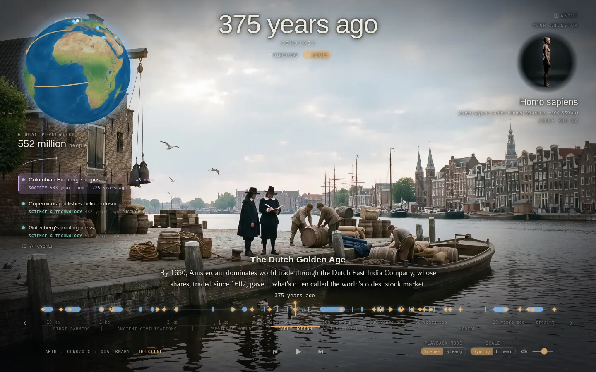
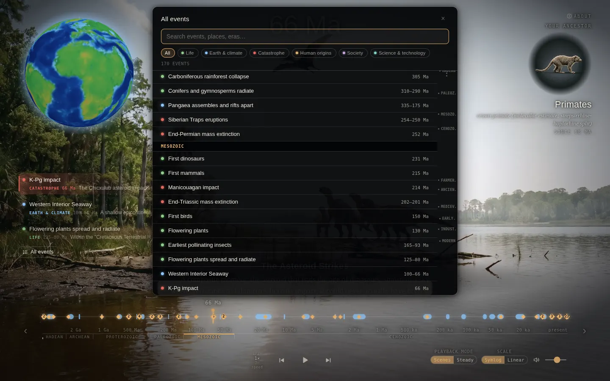
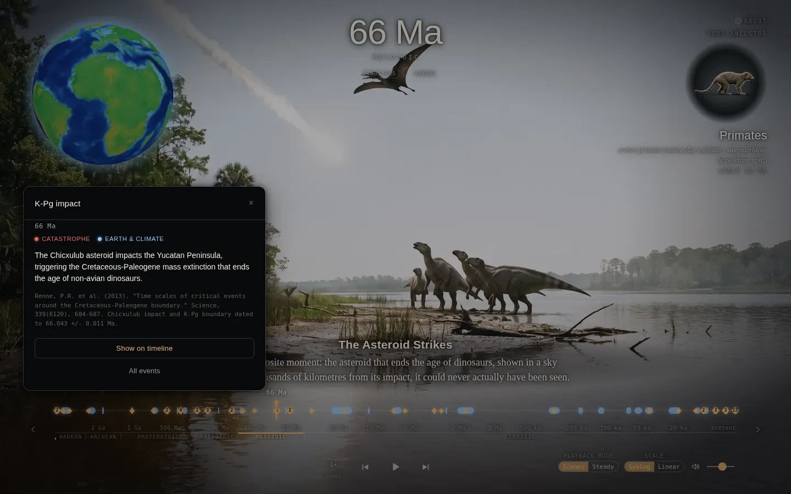
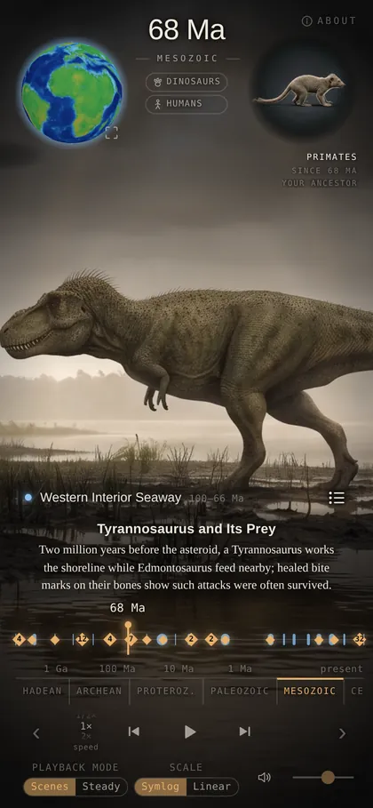

<h1 align="center">Earthlapse</h1>

<p align="center">
  <strong>4.6 billion years of Earth's history, as one continuously evolving, scrubbable view.</strong>
</p>

<p align="center">
  <a href="https://earthlapse.net"></a>
  <a href="docs/DESIGN.md"></a>
  
</p>

<p align="center">
  <a href="https://earthlapse.net"></a>
</p>

<p align="center"><a href="https://earthlapse.net"><strong>Open Earthlapse &rarr;</strong></a></p>

An interactive, immersive visualisation of Earth's history — a continuously evolving
photoreal view of the planet's surface across 4.6 billion years, surrounded by live data
layers, fully scrubbable.

Sit back and watch it play, or grab the timeline and explore: zoom from 4.6 billion years
down to a single year, speed it up, slow it down, toggle layers.

> **Status: in development.** The pipeline and viewer run end to end locally; see
> [Local development](#local-development).

<p align="center">
  <a href="https://earthlapse.net"></a>
  <br><em>68 million years ago: a photoreal scene, captioned, framed by the globe, your ancestor, the event feed and the timeline.</em>
</p>

<p align="center">
  <a href="https://earthlapse.net"></a>
  <br><em>179 years ago, globe expanded: HYDE population density, major cities as they appear, and migration arcs in flight.</em>
</p>

---

## Features

### Photoreal scenes across deep time

71 generated scenes — magma ocean, Carboniferous coal swamp, Cretaceous shoreline,
ice-age steppe, Hadrian's Rome, the present-day city — each captioned and anchored to its moment.
Every still breathes with subtle 2.5D depth parallax rendered live in the browser, and one age
dissolves into the next. No video files anywhere.

<p align="center">
  
</p>

### A paleogeographic globe

An independent three.js globe, driven by real reconstruction data rather than the scene art:
PALEOMAP PaleoDEM elevation and bathymetry for the Phanerozoic, reconstructed Neoproterozoic
continents before that, and stylised, literature-dated regimes further back still. Cenozoic ice
sheets and sea-level lowstands follow the LR04 record. It sits as a small orb in the corner;
click it to expand to a full sphere, or unfold it into a flat map. In human time it carries
dispersal arcs, settlement markers and major cities, plus a switchable **population density**
or **cleared land** overlay from HYDE.

<p align="center">
  
</p>

### A timeline built for 4.6 billion years

The scrub track uses a warped (symlog) scale so the Hadean and the last century both get room, with a
linear option. Narrow it to any era — eon, period, or one of six human-history sections inside
the Holocene — via the section bands, breadcrumb or keyboard. Events cluster and declutter as
you zoom; hovering spreads close-packed markers apart, dragging scrubs. Above the track, each
scene's title and a short passage place it in its moment.

<p align="center">
  
</p>

### Events, with sources

170 curated, cited events — mass extinctions, first dinosaurs, the out-of-Africa migration,
the printing press — tagged by category. A live feed shows what is happening near the cursor;
the **All events** browser searches and filters the whole list by category and era; every event
opens a detail panel with its dates, description, citation and, for human migrations, the route.

<table>
  <tr>
    <td width="50%"></td>
    <td width="50%"></td>
  </tr>
</table>

### Data layers

Real series wherever real data exists: global population (HYDE) as a sparkline that grows with
the story so far, and **your ancestor** — a portrait of the organism in your direct lineage at
that moment, from LUCA through the first eukaryotes and animals to *Homo sapiens*, morphing
between portraits. Atmospheric CO₂ and day length shape the score; ice volume and sea level
shape the globe.

### Playback, sound, and every screen size

Two playback modes: **Scenes** paces itself to linger on each scene, while **Steady** runs at a
constant rate picked from 1 year to a billion years per second. An adaptive Tone.js score
follows the era, with pitch, brightness and pulse drawn from time, CO₂ and day length, turning
dissonant near catastrophes. Keyboard shortcuts cover scrubbing, sections and speed, and a
short first-visit tour introduces the controls. The layout adapts to phones in portrait and
landscape.

<table>
  <tr>
    <td width="30%" align="center"></td>
    <td>
      <strong>Built to be explored anywhere.</strong><br><br>
      On a phone the chrome stacks around the scene: globe and ancestor up top, a single-line
      event strip with an <em>All events</em> sheet, the timeline with its section bands, then
      transport and playback controls — all touch-sized. The globe expands full-screen with a tap.
      <br><br>
      <a href="https://earthlapse.net"><strong>Try it at earthlapse.net &rarr;</strong></a>
    </td>
  </tr>
</table>

---

## What it is

A single view of Earth's surface evolving through deep time — magma ocean, Archean shore,
Carboniferous swamp, Cretaceous forest, Pleistocene steppe, city — as photoreal generated
imagery, breathing with subtle parallax and dissolving from one age into the next.

Around it: an independent 3D globe driven by real paleogeographic data, and a set of data
layers — human population, atmospheric CO₂, sea level and ice volume, the length of a day, and
the organism that was your direct ancestor at that moment. Oxygen, temperature, biodiversity
and the Moon's distance are planned layers.

Everything is a pure function of one time cursor, so playback and exploration are the same
mechanism.

## Principles

- **Continuity over comprehensiveness.** Plausibility is the bar, not precision.
- **Real data wherever real data exists.** Only the *view* is generated.
- **Everything is a pure function of `t`.**
- **Nothing pre-rendered that could be rendered live.** No video files.
- **Contributable.** A new data layer is one directory and one PR.

It is an artistic reconstruction, and says so.

## Documentation

| Document | What's in it |
|---|---|
| [`docs/DESIGN.md`](docs/DESIGN.md) | Architecture, time model, `WorldState`, scene rendering, layout |
| [`docs/VISUAL_SPEC.md`](docs/VISUAL_SPEC.md) | Art direction, prompt architecture, style contract |
| [`docs/GLOBE.md`](docs/GLOBE.md) | The globe: projection, reconstructions, overlays |
| [`docs/DATA_SOURCES.md`](docs/DATA_SOURCES.md) | Every dataset — access, volume, storage, processing |
| [`docs/IMPLEMENTATION.md`](docs/IMPLEMENTATION.md) | Phasing and agent work packages |
| [`docs/DECISIONS.md`](docs/DECISIONS.md) | ADR log |
| [`CONTRIBUTING.md`](CONTRIBUTING.md) | How to add a data layer |

Start with `DESIGN.md`.

## Stack

Python 3.12 for the offline pipeline (pydantic, gplately, xarray, Typer). Next.js +
TypeScript + react-three-fiber for the viewer, Tone.js for the score. Fully static — media on
Cloudflare R2, site as a Cloudflare Workers static-assets deployment
([`deploy/`](deploy/README.md)), no backend.

## Local development

### Prerequisites

- Python 3.12 ([uv](https://docs.astral.sh/uv/) recommended)
- Node.js 24 and pnpm 10
- [Git LFS](https://git-lfs.com/): published images and audio under `data/media/` are LFS objects

### Setup

```sh
git lfs install
git clone https://github.com/Finndersen/earthlapse.git && cd earthlapse
git lfs pull

# Python pipeline. Extras: dev = tests/lint, data = source normalisation,
# geo = plate reconstructions, morph = portrait flow fields
uv venv --python 3.12 .venv
uv pip install --python .venv/bin/python -e '.[dev,data,geo,morph]'

# Web viewer
cd web && pnpm install && cd ..

# Serve the published media to the viewer (gitignored symlink)
ln -s ../../data/media web/public/media
```

### Run the viewer

```sh
make web-dev        # or: cd web && pnpm dev  →  http://localhost:3000
make web-build      # static export to web/out/
```

The viewer loads `/media/manifest.json`. Without the `web/public/media` symlink it falls back
to the placeholder manifest in `web/public/stub/`.

### Tests and checks

```sh
make test                                   # Python tests (offline, fixture-backed)
.venv/bin/ruff check . && .venv/bin/ruff format --check .

cd web
pnpm test                                   # vitest
pnpm typecheck
```

### Pipeline

Everything the viewer needs is already committed. You only need these to change data or media.

```sh
make data                                   # rebuild stale sources into data/curated/
.venv/bin/python -m pipeline.databuild --only <source> --force   # rebuild one source

.venv/bin/earthlapse plan                    # what is stale and what it would cost (spends nothing)
.venv/bin/earthlapse build --max-spend <USD> --only images --candidates 1
.venv/bin/earthlapse review                  # pick candidates; `review portraits` for portraits
.venv/bin/earthlapse morph                   # portrait flow fields (local, free)
make pins                                   # stage pinned candidates for commit
.venv/bin/earthlapse publish --allow-unpinned # write data/media/manifest.json + media
```

`build` calls a paid image generator. It needs generator credentials in a gitignored `.env`
(see `pipeline/generators/`). Spend is capped by the ledger in `spend.json`. Adding a data
layer needs neither: see [`CONTRIBUTING.md`](CONTRIBUTING.md).

## Data

Built on open scientific datasets — PALEOMAP PaleoDEMs, GPlates, the Paleobiology Database,
HYDE, TimeTree, ice-core and proxy records. All cited; see
[`docs/DATA_SOURCES.md`](docs/DATA_SOURCES.md) and the generated credits page.
